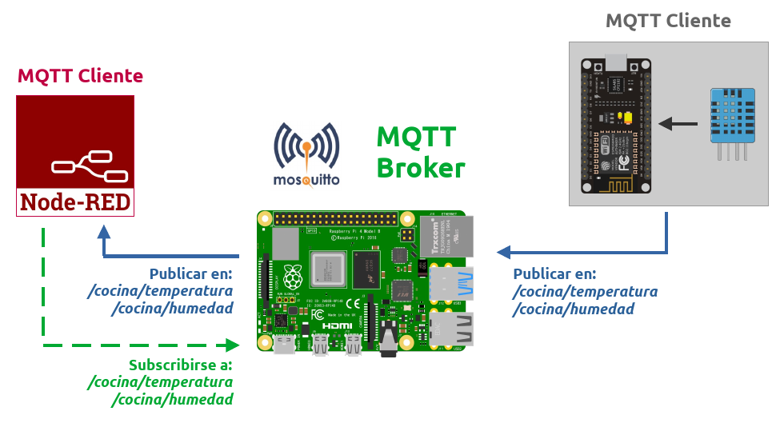
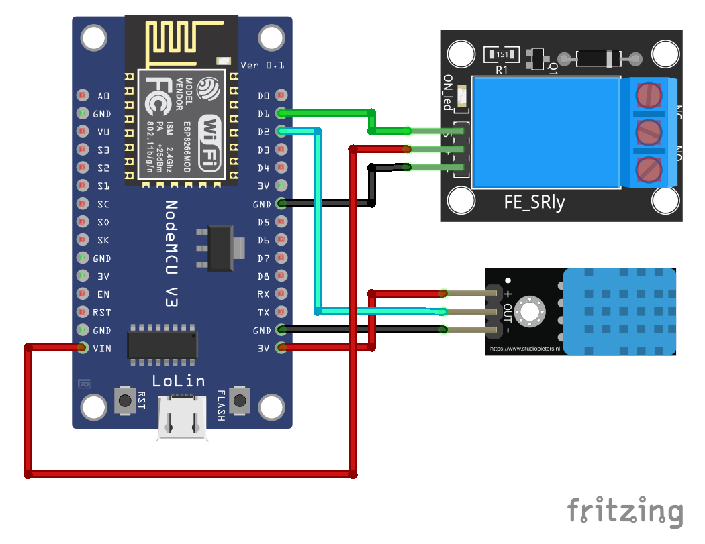
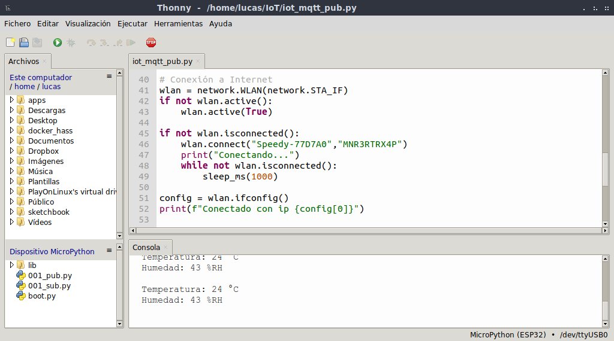
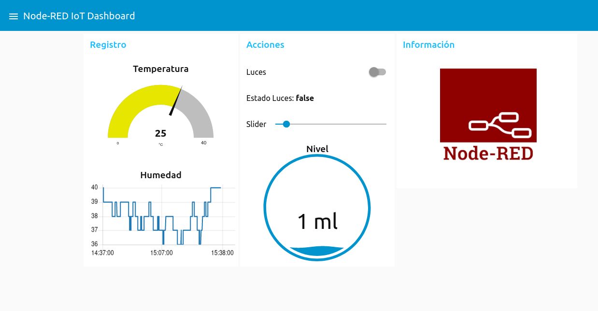

# Panel domótica con Node-RED

Demo de implementación de panel domótico con Node-RED para proyectos de dómotica de bajo costo. 

[Node-RED](https://nodered.org/) es una herramienta de desarrollo basada en flujo para programación visual desarrollada originalmente por IBM para conectar dispositivos de hardware, API y servicios en línea como parte de la Internet de las cosas. Proporciona un editor de flujo basado en navegador web, que se puede utilizar para crear funciones de JavaScript. Los elementos de las aplicaciones se pueden guardar o compartir para su reutilización. El tiempo de ejecución se basa en Node.js. Los flujos creados en Node-RED se almacenan mediante JSON. Desde la versión 0.14, los nodos MQTT pueden realizar conexiones TLS correctamente configuradas. En 2016, IBM contribuyó con Node-RED como un proyecto de OpenJS Foundation de código abierto. [Wikipedia](https://en.wikipedia.org/wiki/Node-RED).

*Arquitectura del sistema*.

## Hardware

El hardware para este demo está basado en una placa NodeMCU (SoC ESP8266) aunque se puede utilizar sin problemas con placas basadas en el SoC ESP32.

*Diagrama esquemático*.

## Firmware con Arduino API

Simulación en línea sobre ESP32, disponible en [Wokwi](https://wokwi.com/projects/378045103778705409).

Para compilar el proyecto necesita las siguientes dependencias:

- [PubSubClient](https://github.com/knolleary/pubsubclient)
- [DHT sensor library](https://github.com/adafruit/DHT-sensor-library)

## Firmware con MicroPython

Simulación en línea sobre ESP32, disponible en [Wokwi](https://wokwi.com/projects/388923768636934145).

Metadata-Version: 1.0
Name: micropython-umqtt.robust
Version: 1.0
Summary: Lightweight MQTT client for MicroPython ("robust" version).
Home-page: https://github.com/micropython/micropython/issues/405
Author: MicroPython Developers
Author-email: micro-python@googlegroups.com
License: MIT
Description: umqtt.robust

umqtt is a simple MQTT client for MicroPython. (Note that it uses some MicroPython shortcuts and doesn't work with CPython). It consists of two submodules: umqtt.simple and umqtt.robust. umqtt.robust is built on top of umqtt.simple and adds auto-reconnect facilities for some of networking errors.

umqtt.robust
umqtt is a simple MQTT client for MicroPython. (Note that it uses some MicroPython shortcuts and doesn't work with CPython). It consists of two submodules: umqtt.simple and umqtt.robust. umqtt.robust is built on top of umqtt.simple and adds auto-reconnect facilities for some of networking errors.

*Thonny IDE*.

## Broker MQTT

El servidor puede estar instalado en una [Raspberry Pi](https://es.wikipedia.org/wiki/Raspberry_Pi) o bien es posible utilizar algún broker público. En este caso utilizamos [test.mosquitto.org](https://test.mosquitto.org/) que alberga un servidor/broker MQTT [Eclipse Mosquitto](https://mosquitto.org/) públicamente. 

El servidor escucha en los siguientes puertos:

- `1883` MQTT, unencrypted, unauthenticated
- `1884` MQTT, unencrypted, authenticated
- `8883` MQTT, encrypted, unauthenticated
- `8884` MQTT, encrypted, client certificate required
- `8885` MQTT, encrypted, authenticated
- `8886` MQTT, encrypted, unauthenticated
- `8887` MQTT, encrypted, server certificate deliberately expired
- `8080` MQTT over WebSockets, unencrypted, unauthenticated
- `8081` MQTT over WebSockets, encrypted, unauthenticated
- `8090` MQTT over WebSockets, unencrypted, authenticated
- `8091` MQTT over WebSockets, encrypted, authenticated

[MQTT Explorer](http://mqtt-explorer.com/)

*MQTT Explorer*.

## Implementación con Node-RED

*Node-RED Editor*.

*Dashboard UI*.

## Recursos

- [ESP32 Pinout Reference: Which GPIO pins should you use?](https://randomnerdtutorials.com/esp32-pinout-reference-gpios/)
- [ESP8266 Pinout Reference: Which GPIO pins should you use?](https://randomnerdtutorials.com/esp8266-pinout-reference-gpios/)

## Licencia

Este trabajo está protegido por la **Licencia MIT**. Puedes acceder a la versión original de la licencia (en inglés) a través del archivo [LICENSE](./LICENSE) o en línea en [The MIT License (MIT)](https://mit-license.org/). También proporcionamos una traducción no oficial desde [Wikipedia](https://es.m.wikipedia.org/wiki/Licencia_MIT#La_licencia):

Copyright (c) 2024 Lucas Martín Treser

Por la presente se concede permiso, libre de cargos, a cualquier persona que obtenga una copia de este software y de los archivos de documentación asociados (el "Software"), a utilizar el Software sin restricción, incluyendo sin limitación los derechos a usar, copiar, modificar, fusionar, publicar, distribuir, sublicenciar, y/o vender copias del Software, y a permitir a las personas a las que se les proporcione el Software a hacer lo mismo, sujeto a las siguientes condiciones:

El aviso de copyright anterior y este aviso de permiso se incluirán en todas las copias o partes sustanciales del Software.

EL SOFTWARE SE PROPORCIONA "COMO ESTÁ", SIN GARANTÍA DE NINGÚN TIPO, EXPRESA O IMPLÍCITA, INCLUYENDO PERO NO LIMITADO A GARANTÍAS DE COMERCIALIZACIÓN, IDONEIDAD PARA UN PROPÓSITO PARTICULAR E INCUMPLIMIENTO. EN NINGÚN CASO LOS AUTORES O PROPIETARIOS DE LOS DERECHOS DE AUTOR SERÁN RESPONSABLES DE NINGUNA RECLAMACIÓN, DAÑOS U OTRAS RESPONSABILIDADES, YA SEA EN UNA ACCIÓN DE CONTRATO, AGRAVIO O CUALQUIER OTRO MOTIVO, DERIVADAS DE, FUERA DE O EN CONEXIÓN CON EL SOFTWARE O SU USO U OTRO TIPO DE ACCIONES EN EL SOFTWARE.
